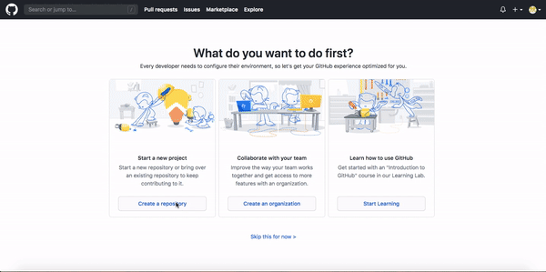
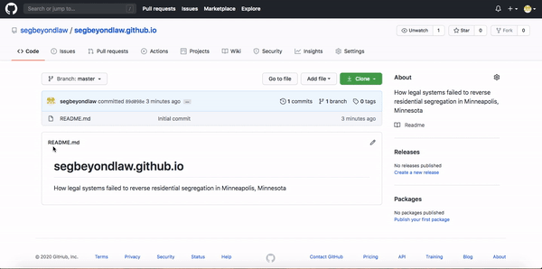
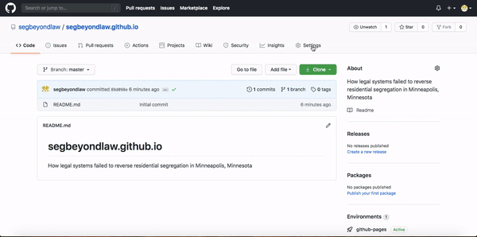
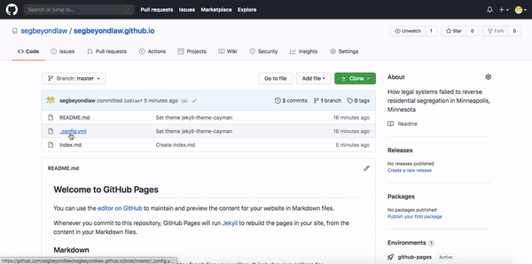

# How to Build a Website 
## Part 1: Building Basics

 - [Introduction](#introduction)
    - [Choosing a platform](#subparagraph1)
    - [Choosing a domain name](#subparagraph2)
    - [Building your website](#subparagraph3)
- [Create an account](#paragraph1)
- [Tell Github about yourself, and your needs](#paragraph2)
- [Creating a repository (repo)](#paragraph3)
- [Exploring your repo homepage](#paragraph4)
- [Choosing a theme](#paragraph5)
- [Check your repo homepage](#paragraph6)
- [Create your website’s homepage](#paragraph7)
  - [Using README.md as a guide](#subparagraph4)
- [Committing (saving) the file](#paragraph8)
- [Making a website header](#paragraph9)
- [Viewing the final product](#paragraph10)

## Introduction:  
You’ve decided to create a website to expand your platform and showcase your work... now what? Before actually building your website, you’ll need to choose a platform to host your website and an easily-identifiable domain name. 

### Choosing a platform: 
To get started, think about what website features you’ll need to display your content-- do you want to post pictures, have a blog section, sell merchandise, etc.? Next, what are your needs as a creator -- what level of web programming are you comfortable with? Do you want to have ads or an independent domain name? What is your budget?  

On Datacts, we’ll be teaching you to build a website using GitHub Pages, a free platform. If your needs require something else, you can check out guides from [wpbeginner](https://www.wpbeginner.com/beginners-guide/how-to-choose-the-best-website-builder/) and [gettheclicks](https://www.gettheclicks.com/web-design/website-platforms/), comparing the pros and cons of other popular website builders.  

### Choosing a domain name: 
A strong domain name is one of the most important parts of your website! Your domain name represents your brand, it’s the first thing those visiting your website see, and -- most importantly -- it plays a huge role in SEO, or search engine optimization. Improving SEO allows more people to organically access and learn about your work.  It’s a complicated process involving 200+ factors -- you can read more about it on [backlinko](https://backlinko.com/google-ranking-factors) and [moz](https://moz.com/learn/seo/what-is-seo) -- so we’ll focus on a few, basic tips that’ll help you create a recognizable, optimized domain name: 

Your domain name should be **specific, short, and easy to type**. **Specific:** your domain name should be unique to your brand, and reflect the work you do and content your produce. It can (and often should) be different from the name of your organization, using an acronym or a specific term. Similarly, it should relate to your social media handles. For example, the NJ Institute for Social Justice uses the website domain “njisj.org” and the social media handle @dosocialjustice. **Short:** the average domain length is 12 characters; for SEO optimization, you should aim between 6 and 14 characters. **Easy to type:** your domain name should be memorable -- including easy spelling and minimal confusion about word order, if you’re using an acronym.  To learn more about choosing and optimizing your domain name, check out this guide provided by websitesetup. 

### Building your website: 
Once you’ve chosen a unique domain name, you’re ready to get started. Here, we’ll walk you through the steps of creating a GitHub account and building the basics of your website. 

## 1. Create an Account: 

Go to [github.com](github.com) and create an account. Under “Username” write the name of your organization or the name of the website you will be creating. My example username will be **my-own-username** and the address for the site I set up will be [http://segregationbeyondlaw.github.io](http://segregationbeyondlaw.github.io). 

## 2. Tell Github about yourself, and your needs: 

 
After creating an account, a survey will pop up, asking you the following:  
- What kind of work do you do mainly?
  - For this example, we clicked “Other” and typed in “Activist”
- How much programming experience do you have?
  - Click a box with your experience level. It’s ok if the answer is none! We all have to start somewhere. 
- What do you plan to use Github for? 
  - Click the box that says “Create a website with GitHub Pages”
- I am interested in: 
  - We left this one blank... 
  

## 3. Creating a repository (repo): 

A repository, or repo, is a folder for a project. You’ll be putting files inside the repo to build your website. Github will save all past versions of your repo, so you can always go back to a previous version.

 

GitHub will now direct you to a page titled “Create a new repository”.
- Under “Repository name,” type out the full URL of the website you are creating, noting it MUST end in “.github.io”. Use your username/domain name as the first part of the URL. For example, we chose segregationbeyondlaw.github.io. 
- Under “Description” you can add a description if you’d like or leave it blank and come back to it later. 
There are two options for your repo: “Public” or “Private”.
  - **Public:** People will be able to see your repo on the internet and your edit history of that repo. Of course, given that you’re creating a website, the content will be visible on the internet, anyway.
  - **Private:** If you’d prefer people not to be able to see your edit history as you update your site, there’s good news for you! As of 2019, free users can make private accounts. However, there is a small catch -- under a free account, no more than three separate github accounts can collaborate. 
- it’s good practice to include a .README file in your repo, which is a text file that will be the first thing anyone viewing the repo will see. Click the check box next to “Initialize this repository with a README”.
- In this example we did not use “Add .gitignore” and “Add a license”. “.gitignore” will likely not be important, but if you want to read more about licensing, you can check out GitHub’s info button.

## 4. Exploring your repo homepage: 

 
Now, let’s take a look at the home page for your repo, which will serve as the backstage for your website (You can also ignore any pop ups). There’s a lot of information here, but luckily, only a couple of clicks will be necessary for you to create a website. Notice two things: 
- You only have one file: A README.md file with your website name should appear with your description. 
- You only have one “commit”: Each time you make changes that you save, this will be known as a “commit”. Right now you have just one, since you just started your website. Commits are what provide an edit history. You can return to previous commits if you want to revert your website to its previous state.

## 5. Choosing a theme: 

Click on “Settings,” which is on the rightmost side with a gear icon. On the first page it leads you to, scroll down until you get to the section called “GitHub pages”. Under “Theme Chooser”, click “Choose a theme”. Your theme is for aesthetic purposes, and you can always go back and change it.  When you’ve chosen one that works for you, click “Select theme”. In our example, we chose “Cayman.” 

## 6. Check your repo homepage: 

Once you choose a theme, you’ll be redirected back to your repo homepage under the “Code” tab, where you will see that new commits have been made. The README.md file has been edited to show you how to format text for your website. 
-Open README.md in a new tab so you can reference it; you will use the format it shows you to create the “Markdown” files, which will form your website pages. 

## 7. Create your website’s homepage: 

Click “Create new file”. You will be directed to another page. Then, in the box that says “Name your file,” type “index.md”. The “.md” stands for markdown. This will create the homepage of your website.

### Using README.md as a guide: 

Now remember how we opened README.md in another tab? Use this as your guide for formatting your home page. You can also click the “preview” tab to see what it will look like. It takes some trial and error, but you can toggle back and forth very easily. 

## 8. Committing (saving) the file: 

When you are done, click “commit new file”. It is good practice to add a description. For instance, you could write “first draft of homepage.” This way, if you come back to your GitHub account to resume your website, you’ll remember where you last left off.

## 9. Making a website header: 

Now it’s time to make a header name for your website. If you don’t, your website name will be your URL. 
- To edit your website header name, in your repo, open the file “_config.yml”. This is the file that determines the configuration of your website. Note your theme is stored here. 
- Hit the edit button, indicated by the pencil icon.
- Now, type “title: ” and type in the title name of your choosing. In this example, we chose “Segregation Beyond the Law”
- **Always remember to commit changes!**

## 10. Viewing the final product:  
  
To view your website, type your repository name into the address bar (in my case, my-own-username/segbeyondlaw.github.io). The finished product should look something like this:

 
  
 

